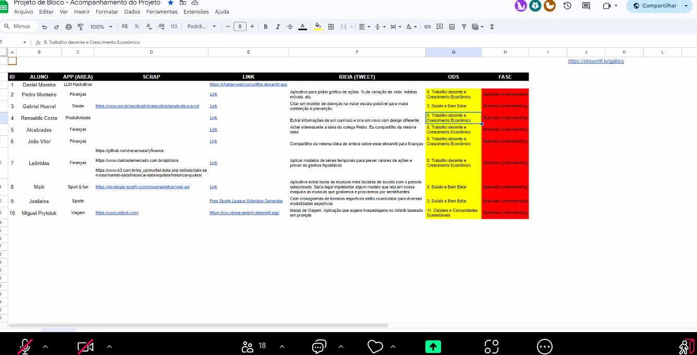
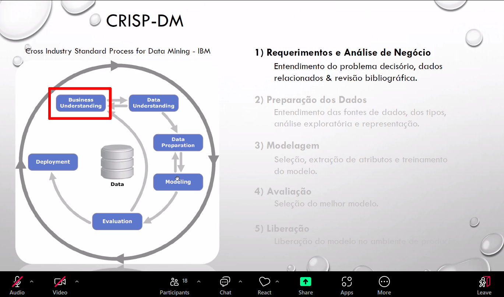
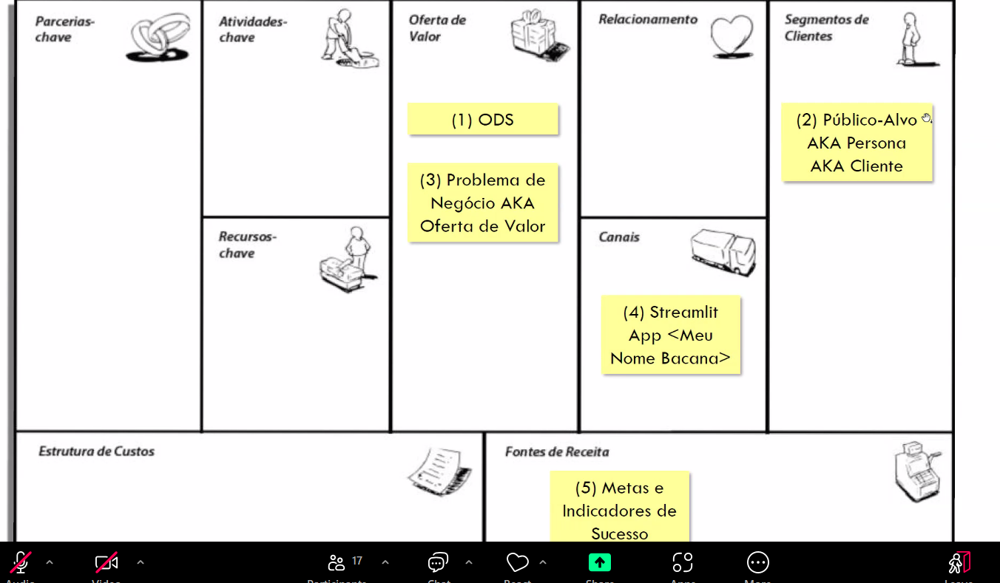
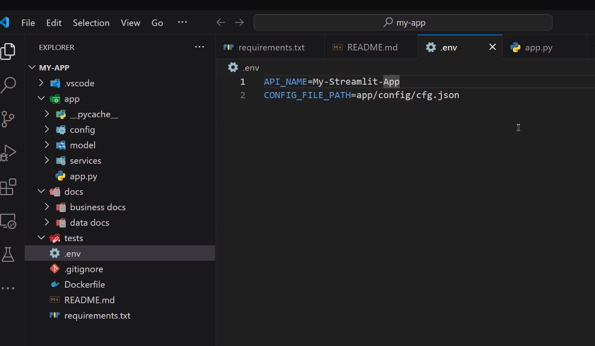
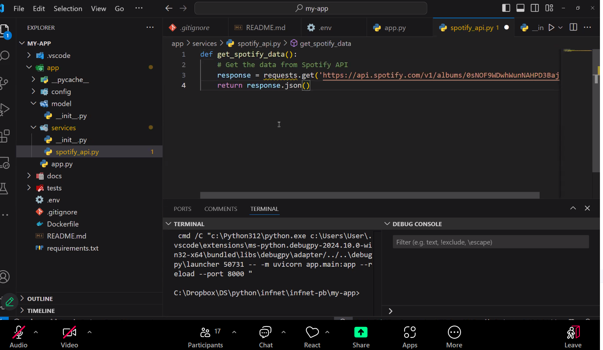
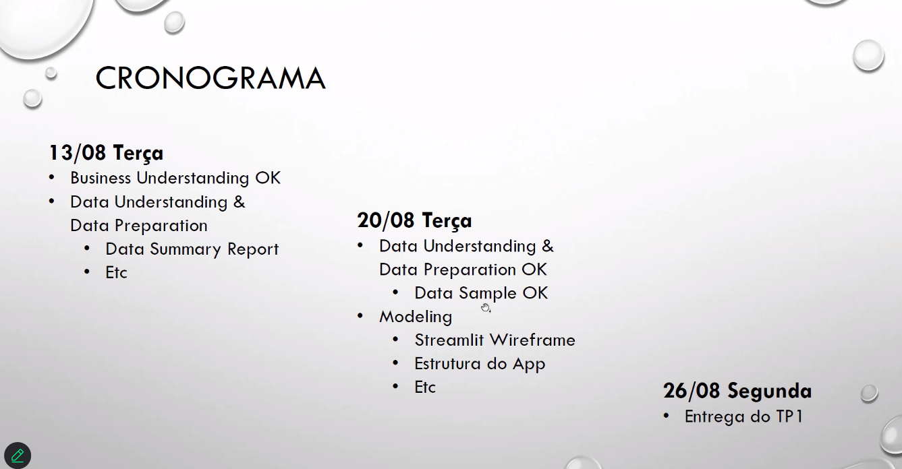
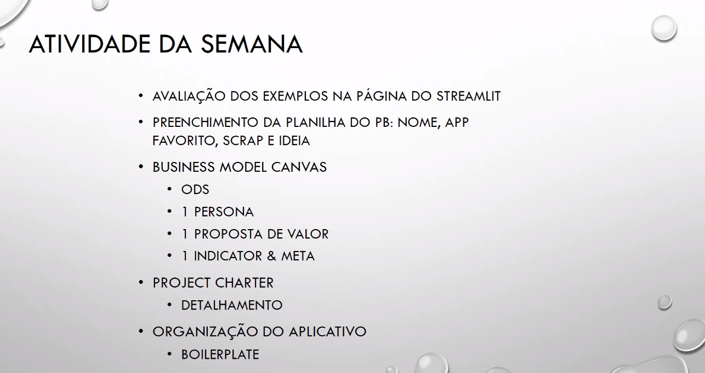

# 06 Agosto 2024

- CRISP
- TDSP?
- Começar o TP
- Artefato: Business Model Canvas
- TDSP estrutura
- Ler rubricas | descricao do TP1
- Gerar valor com quais dados

## Exercício da semana

### Business Model Canvas | Artefato

- Identificar ODS (Objetivos de Desenvolvimento Sustentável)
- Identificar persona
- Oferta de valor
- Canal (Streamlit) | Nome do App legal
- Metas: Conseguir ler as músicas e gerar uma playlist, crawlear esta semana, salvando em banco

### Project Charter | Artefato

- Exemplo
- https://github.com/Azure/Azure-TDSP-ProjectTemplate/blob/master/Docs/Project/Charter.md
- Plan | Milestones | Dividir em fases: Exemplo de items de cada app | Marcos críticos | Big picture
- Comunications | Reunião Professor | Testes com "parente"

### Organizaçao do projeto .git

### Cronograma

- Planilha de Ideias: https://docs.google.com/spreadsheets/d/1Nk4RZ9yf9AO4TKV2ya_7Q6KmHFIHdkNoDBwddv-jLxU/edit?gid=0#gid=0

### Atividade Semana

