# 06 Agosto 2024

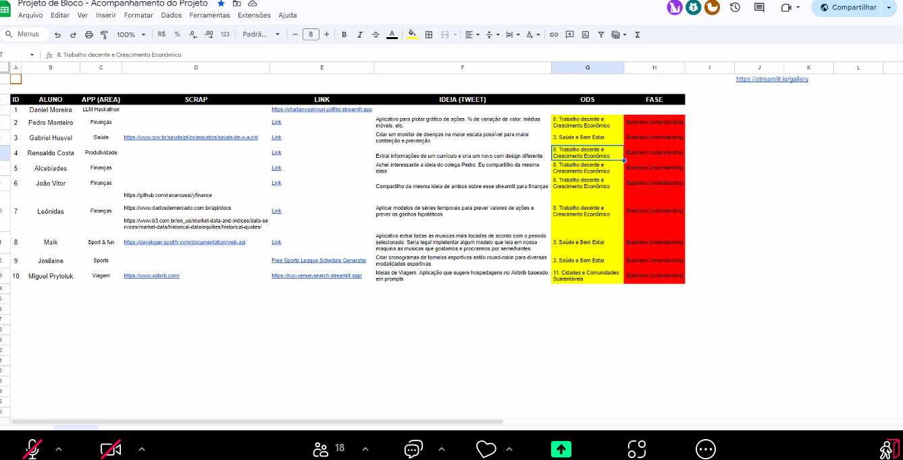
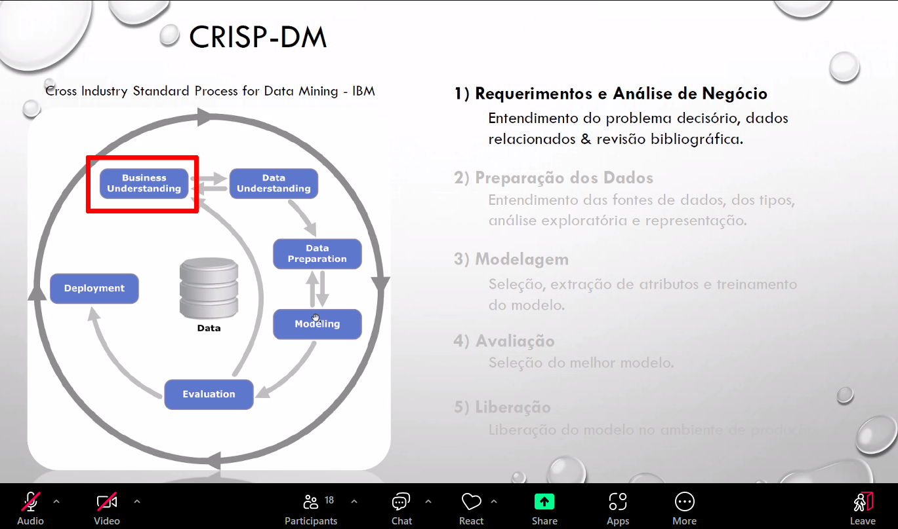

- CRISP
- TDSP?
- Começar o TP
- Artefato: Business Model Canvas
- TDSP estrutura
- Ler rubricas | descricao do TP1
- Gerar valor com quais dados

## Exercício da semana

### Business Model Canvas | Artefato

- Identificar ODS (Objetivos de Desenvolvimento Sustentável)
- Identificar persona
- Oferta de valor
- Canal (Streamlit) | Nome do App legal
- Metas: Conseguir ler as músicas e gerar uma playlist, crawlear esta semana, salvando em banco

### Project Charter | Artefato

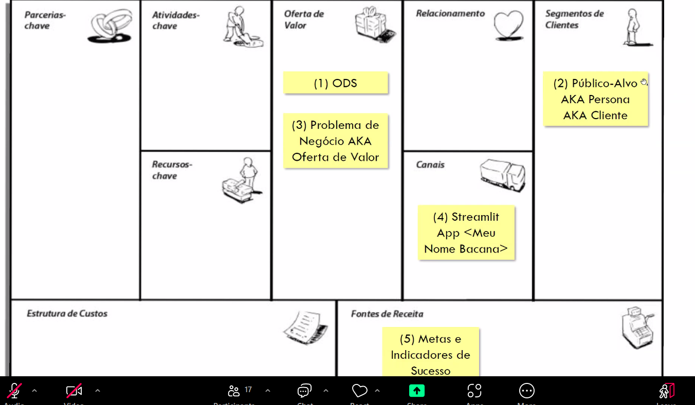

- Exemplo
- https://github.com/Azure/Azure-TDSP-ProjectTemplate/blob/master/Docs/Project/Charter.md
- Plan | Milestones | Dividir em fases: Exemplo de items de cada app | Marcos críticos | Big picture
- Comunications | Reunião Professor | Testes com "parente"

### Organizaçao do projeto .git

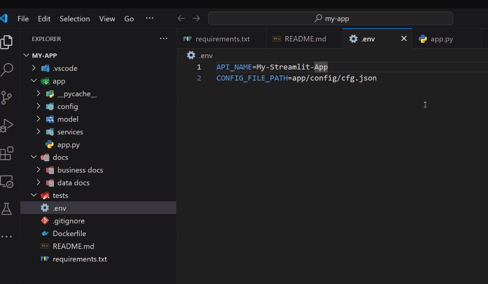
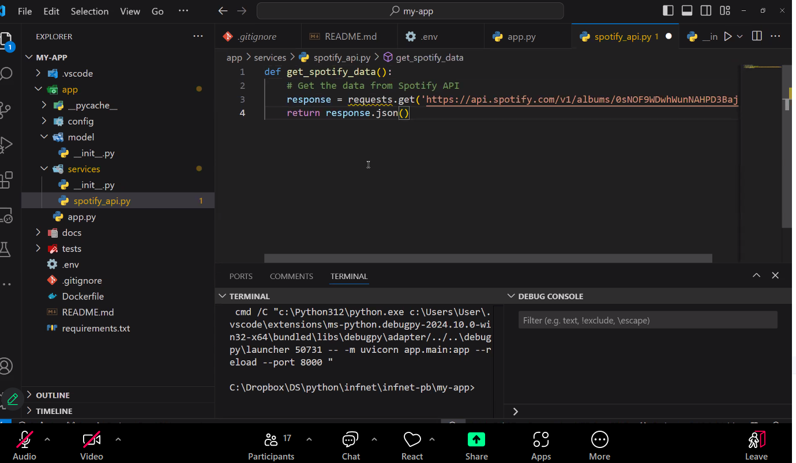

### Cronograma

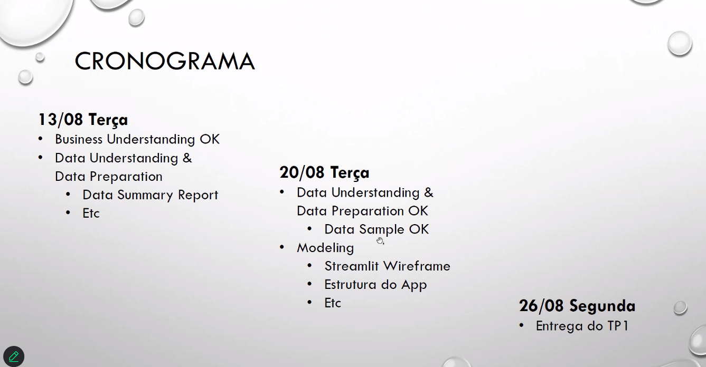

- Planilha de Ideias: https://docs.google.com/spreadsheets/d/1Nk4RZ9yf9AO4TKV2ya_7Q6KmHFIHdkNoDBwddv-jLxU/edit?gid=0#gid=0

### Atividade Semana

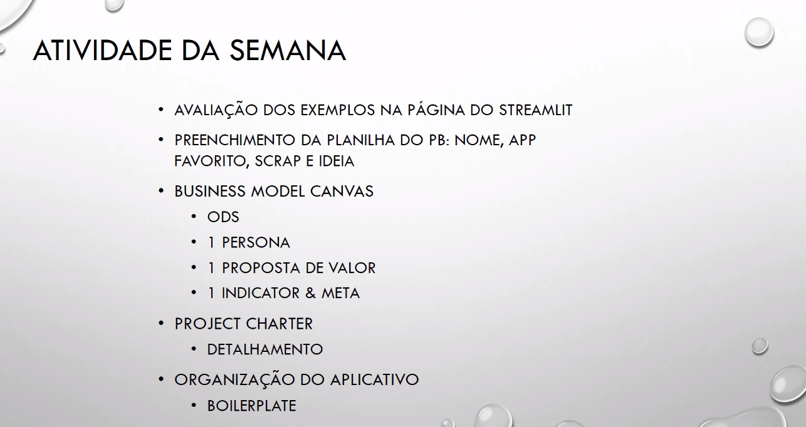

# 20 Agosto 2024

- Tipos de modelos de aprendizado
  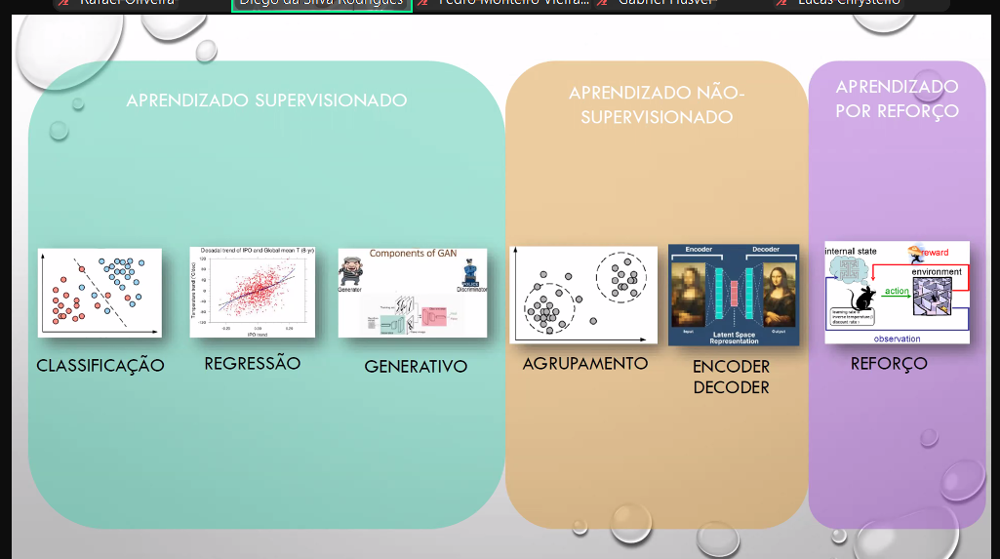
- Aprendizado Supervisionado
  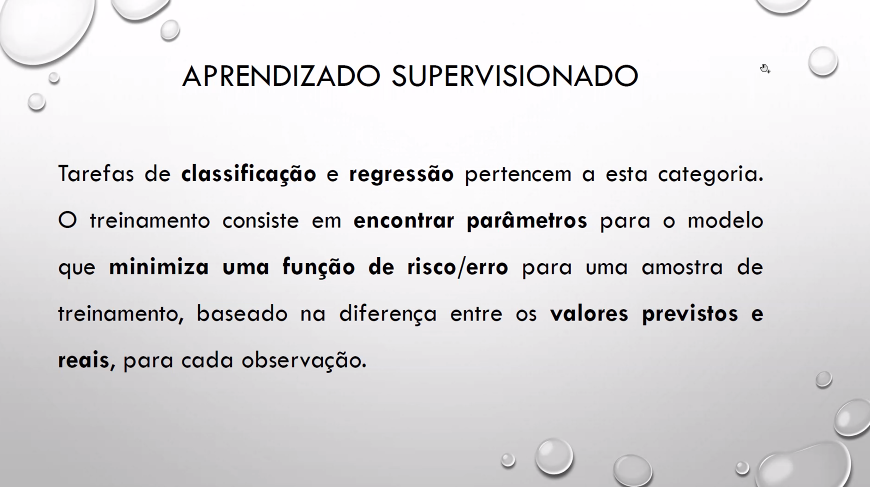

  - Deve possuir dados para serem treinados
  - Todo algoritimo são baseados em um scaling de parâmetros
  - Por exemplo, ratos e elefantes
  - SVM, tenta achar retas que encontram os parametros baseados nos dados
  - Estatística com Otimização
  - Encontrar a menor taxa de acerto baseado em um dados
- Classificação
  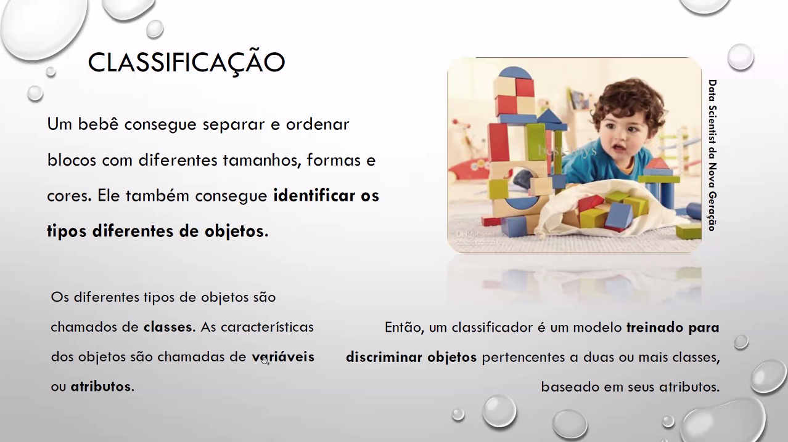
- Algoritimos Baseados em Densidade
  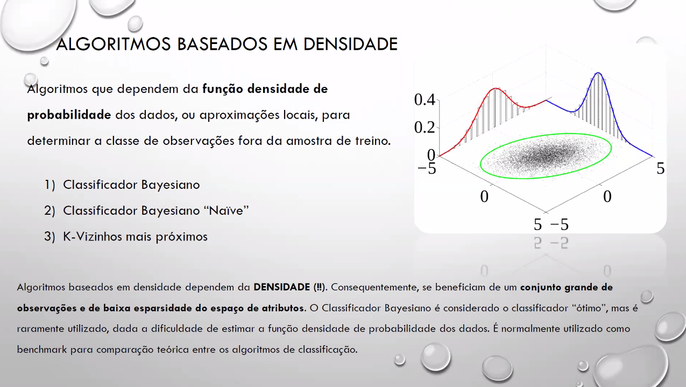
- PDF
  Média e Desvio Padrão (Altura/Peso)
- Abordagem por probabilidade/densidade
- Generativo também tem relação com a PDF
- Amostragem Próxima, Densidade Local
- Modelos Funcionais
  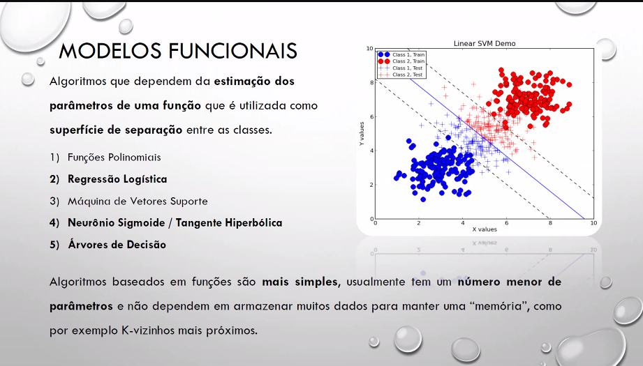

  - Separador linear
  - Não precisa tanto de uma PDF de cada Classe
  - Depende de menos paramêtros
  - Depois de saber os parâmetros
- Deep learning são baseados em em topogias neurais

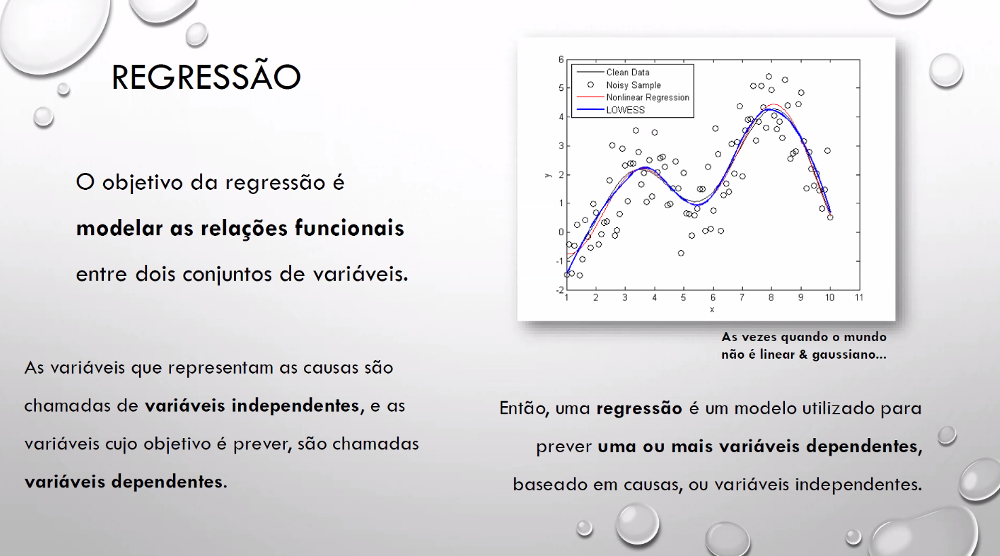
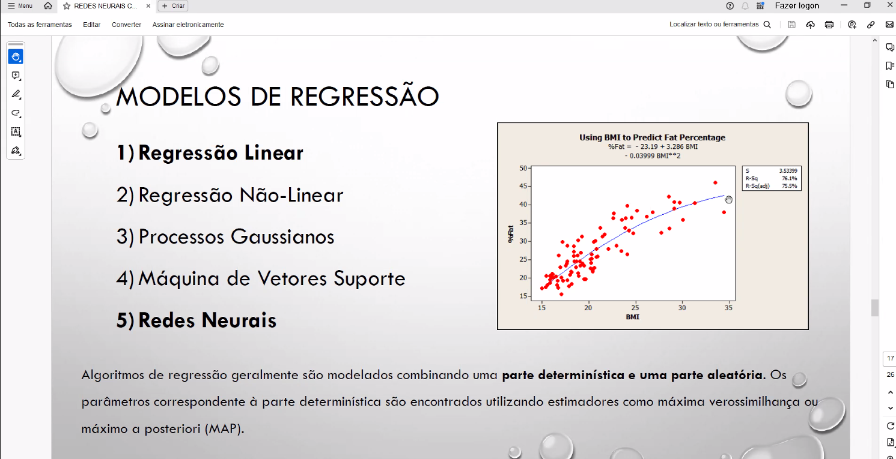
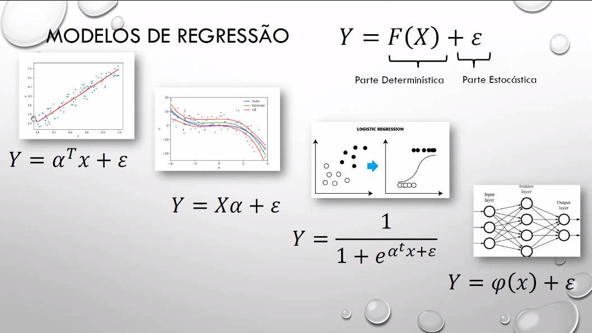

## Artefatos

Tp1 deve usar preferêncialmente scrapping e LLM

- Wireframes
  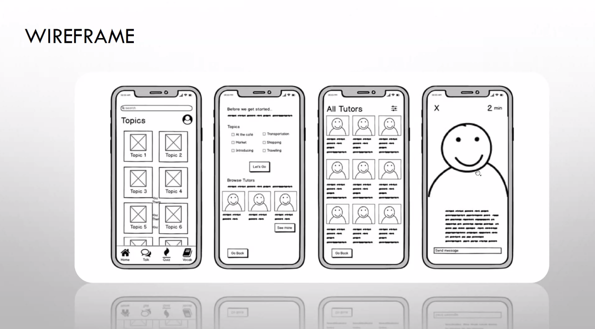
  - Jornada do Usuário (Pode ter multiplas jornadas dependendo de cada objetivo)
- Exemplo OLX (Classificação de itens perigosos)
- Do Wireframe -> Layout
  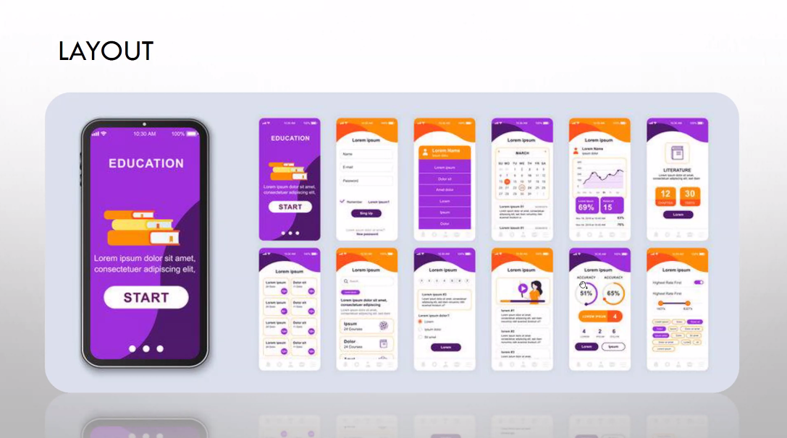

### Entregas Obrigatórias:

- Streamlit apenas
- Subir uma amostra de dados
  - Amostra é o todo
  - Cada linha é uma observação
- Wireframe
- Amostra de Dados
  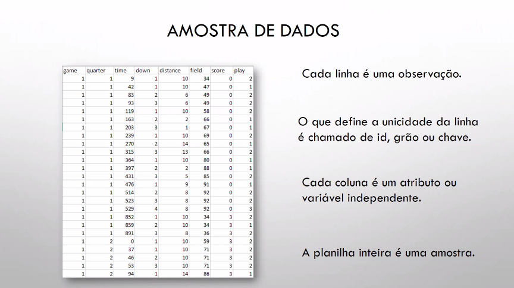
- Aplicação Demo

### Misc

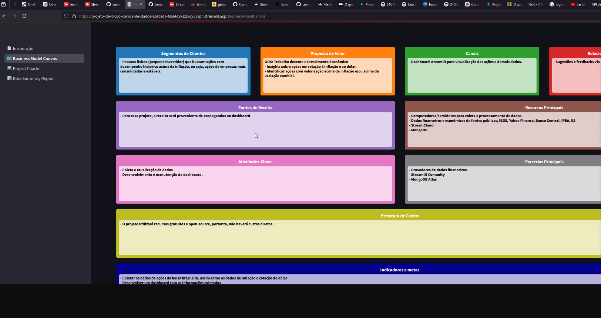
